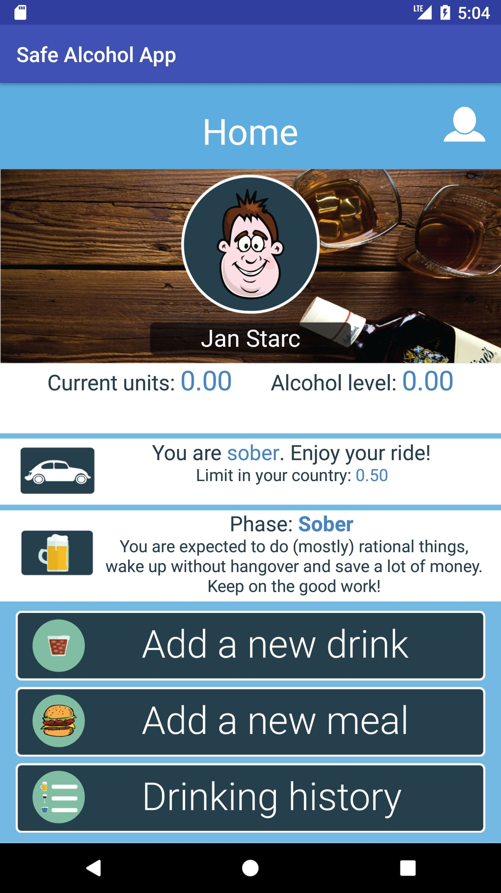
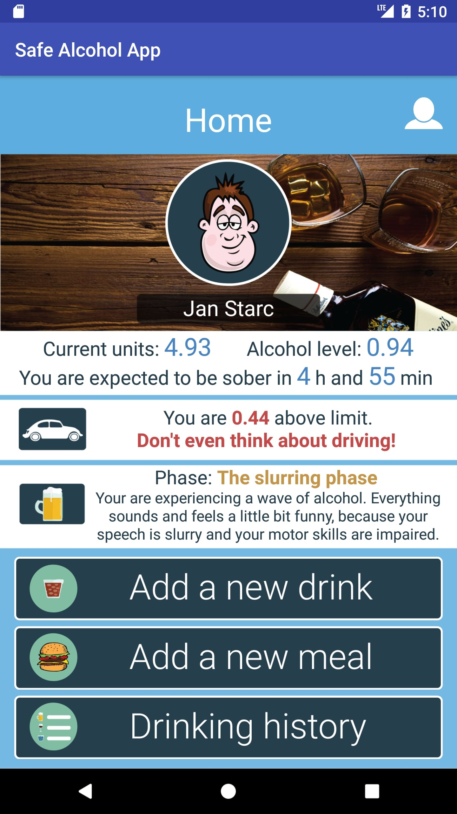
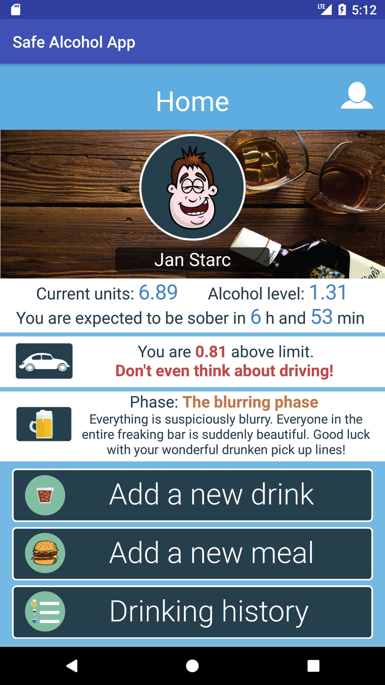
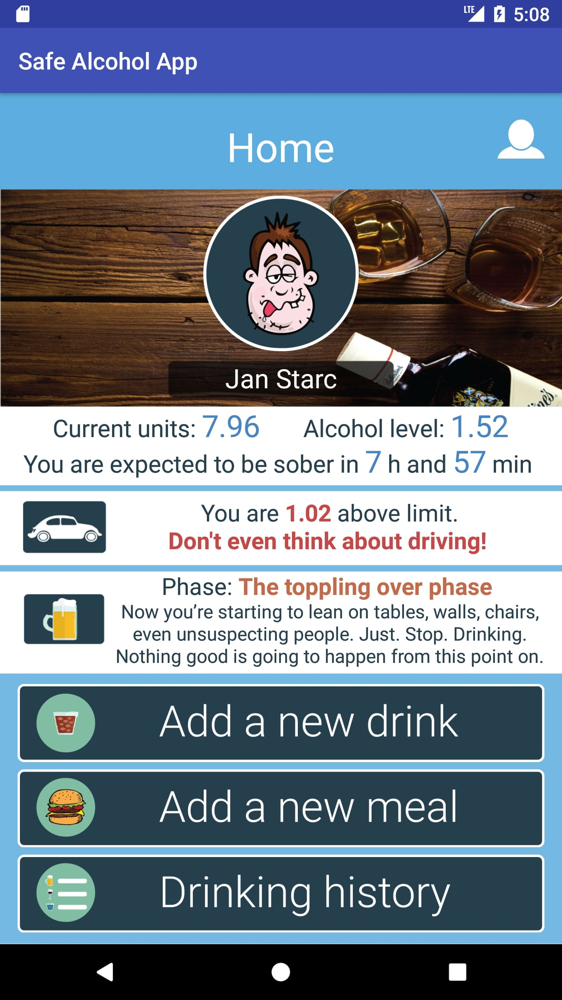
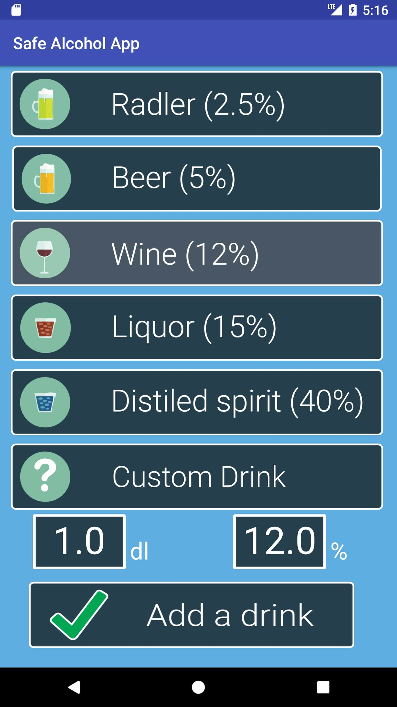
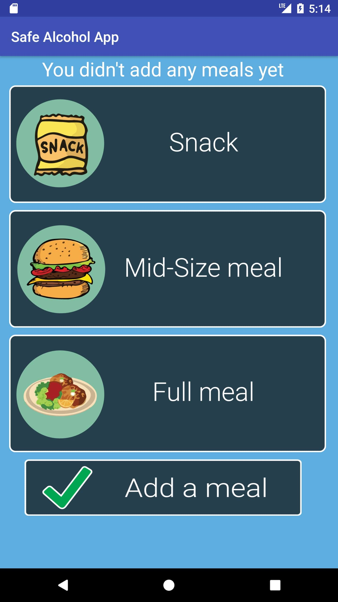
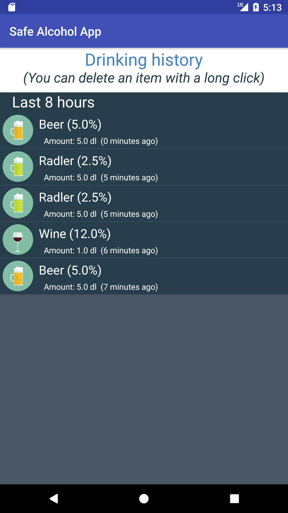
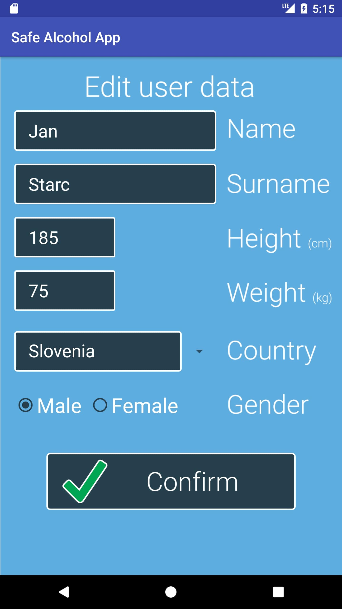

# SafeAlcoholApp
**SafeAlcoholApp** is an Android app, which estimates your breath alcohol content and your ability to drive based on the drinks you've had, food you've eaten and your height/weight/gender.

*(**Note**: To be used for entertainment purposes only)*

## Activities
The **SafeAlcoholApp** has five activities in order to achieve the best user experience
### 1. Home
The first activity visible to the user when the app is opened. The main info in this activity are:
 - Current alcohol units and breath alcohol content
 - Expected time needed to sober up
 - Info about legal limit to drive in your country
 - Sobriety (or drunkenness) phase message
 
  
 

  

    
  

  

    
  

     

  

    
  

  

    
  

### 2. Add a drink
Here, users can add drinks to the app. When a drink is added, alcohol units and breath alcohol content is calculated. The alcohol content of drinks (button's label text) is only informative - amount and percentage of every drink added can be edited. For the **Custom drink** (last drink on the list) also the name can be edited.

### 3. Add a meal
In this activity, users can add their meals to make the breath alcohol content estimate more accurate. Snacks can be added every 15 min, mid-size meal every hour, and full meal every 3 hours.

### 4. Drinking history
Users can see the drinks they had in the last 8, 24 or 72 hours, to see where their alcohol level is coming from. They can also delete drinks from list with a long click.

### 5. User data
Here, users can enter or edit their user data, such as name, surname, height, weight, gender and current country (relevant because different alcohol concentration is permitted in different countries).

